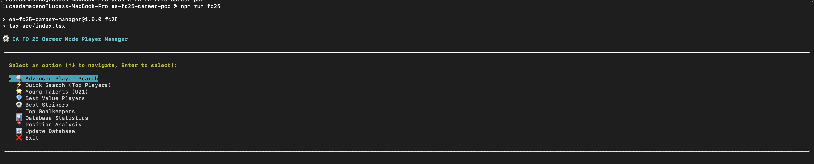
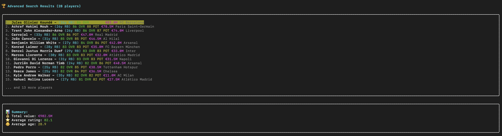
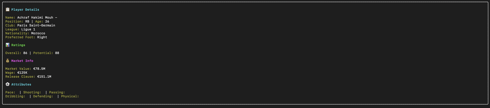

# EA FC 25 Career Mode Player Manager

A modern React CLI application for managing EA FC 25 career mode data with advanced player search, analytics, and team building features.

## Screenshots







## 🚀 Quick Start

```bash
# Install dependencies
npm install

# Run the interactive React CLI
npm run fc25
```

## ✨ Features

- **🔍 Advanced Player Search**: Filter by position, rating, age, price, and more
- **⚡ Quick Search Presets**: Top players, young talents, value players, best strikers
- **📊 Database Analytics**: Complete statistics and position analysis  
- **💎 Market Intelligence**: Find undervalued players and best deals
- **🎯 Career Mode Tools**: Real-time data from 18,000+ EA FC 25 players
- **🔄 Live Updates**: Update database with latest player data

## 🛠️ Installation

1. Clone this repository:
   ```bash
   git clone <repository-url>
   cd ea-fc25-career-poc
   ```

2. Install Node.js dependencies:
   ```bash
   npm install
   ```

3. Run the interactive CLI:
   ```bash
   npm run fc25
   ```

## 💻 Usage

### Interactive React CLI
The main interface provides several options:

- **🔍 Advanced Player Search**: Custom search with multiple filters
- **⚡ Quick Search (Top Players)**: Find 90+ rated players
- **🌟 Young Talents (U21)**: High potential young players
- **💎 Best Value Players**: Market deals and bargains
- **⚽ Best Strikers**: Top attacking players by position
- **🥅 Top Goalkeepers**: Elite goalkeeper options
- **📊 Database Statistics**: Overview of player database
- **📍 Position Analysis**: Breakdown by player positions

### Example Searches
- Find world-class strikers: Use Quick Search → Best Strikers
- Scout young talent: Use Young Talents for players under 21 with high potential
- Find bargains: Use Best Value Players for market deals
- Custom search: Use Advanced Search for specific criteria

## 📁 Project Structure

```
src/
├── AdvancedApp.tsx     # Main React CLI application  
├── database.ts         # Database and CSV data handling
├── types.ts           # TypeScript interfaces
└── index.tsx          # CLI entry point

dataset/
└── player-data-full-2025-june.csv  # EA FC 25 player data

data/
└── players.db         # SQLite database
```

# Find best players under 50M budget
python main.py search --max-price 50000000

# Find best young talents
python main.py search --max-age 21 --min-potential 85
```

### Update Player Data
```bash
python main.py update-data
```

## Project Structure

```
ea-fc25-career-poc/
├── src/
│   ├── models/           # Data models for players, teams, etc.
│   ├── data/            # Data handling and storage
│   ├── analysis/        # Market analysis and player evaluation
│   └── cli/             # Command-line interface
├── data/                # Player databases and cache files
├── config/              # Configuration files
└── tests/               # Unit tests
```

## Configuration

Create a `.env` file in the root directory to configure the application:

```env
# API Configuration (if using external data sources)
FUTBIN_API_KEY=your_api_key_here

# Database Configuration
DATABASE_PATH=data/players.db

# Cache Settings
CACHE_DURATION_HOURS=24
```

## Contributing

This is a personal project for career mode management. Feel free to fork and customize for your own needs!
